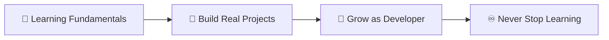

# 🌱 Hi, I'm Safae Beytour

<div align="center">

### Full-Stack Developer | Passionate Learner | Builder of Meaningful Things

</div>

---

I'm a Full-Stack Developer who sees code as a canvas for creativity and problem-solving. Every line I write is part of a journey—one where curiosity drives innovation, teamwork sparks collaboration, and continuous learning fuels growth. I transform ideas into tangible solutions, one commit at a time.

## ✨ About Me

```typescript
const safae = {
    role: "Full-Stack Developer",
    mindset: ["curious", "collaborative", "growth-oriented"],
    believes: "Good code = patience + clarity + practice",
    motto: "Learning never stops, neither do I"
};
```

- 🔍 **Perpetual Learner** – Every project teaches me something new
- 🤝 **Team Player** – Great things happen when minds collaborate
- 🚀 **Challenge Seeker** – Obstacles are just opportunities in disguise
- 🧘‍♀️ **Thoughtful Coder** – Quality comes from intention, not speed

## 🛠 What I Build

I craft solutions that matter—from robust backend systems that power seamless experiences to intuitive interfaces that users love. Each project is a playground for:

- 🧩 **Problem-Solving** – Breaking down complexity into elegant solutions
- 🏗️ **Architecture** – Building scalable, maintainable systems
- 🎨 **User Experience** – Creating interfaces that feel natural
- 📚 **Learning** – Exploring new tools, patterns, and paradigms

## 📈 Current Goals



- 🎯 **Deepen Technical Mastery** – Strengthening core foundations
- 🚀 **Ship Real Solutions** – Building projects that solve actual problems
- 🤝 **Cultivate Best Practices** – Growing as both a coder and collaborator

## 📫 Connect With Me

<div align="center">

[](https://linkedin.com/in/sbeytour)
[](mailto:beytour.safae@gmail.com)

</div>

---

## 🌟 Fun Fact

> *"Every project, no matter how small, teaches something valuable."*
>
> That's not just a belief, it's the philosophy that drives my growth as a developer.

---

## 💻 Technical skills

<div align="center">

### Languages & Frameworks


### Databases & Tools


</div>

---

<div align="center">

⭐ *Building the future* ⭐

</div>